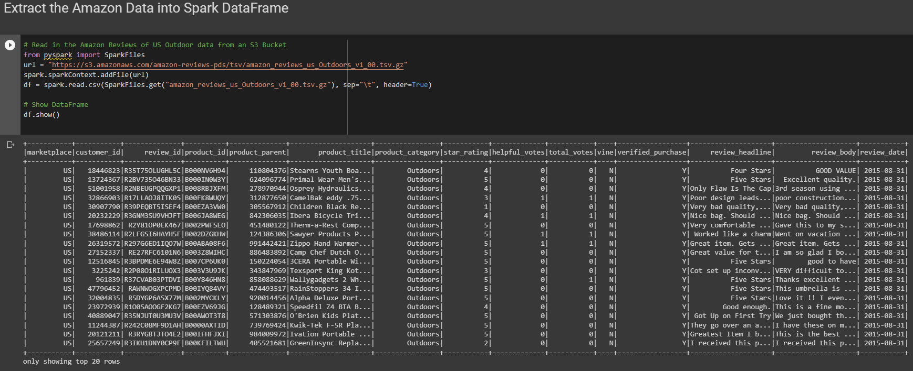
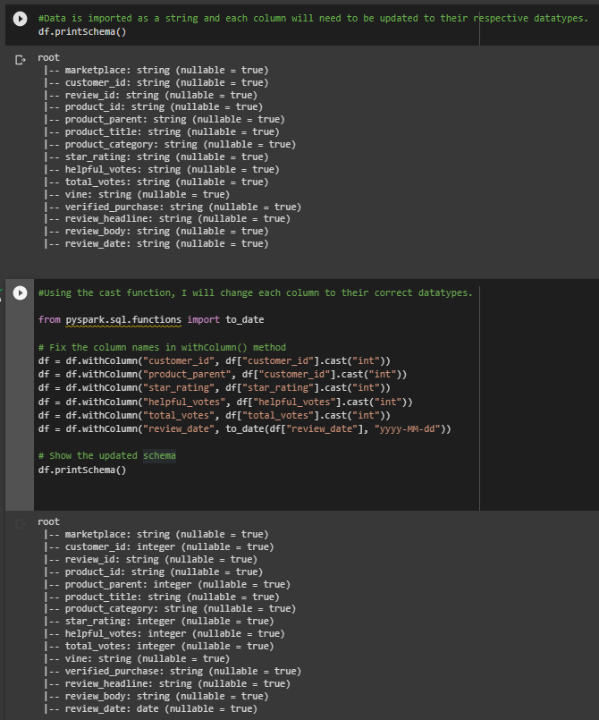
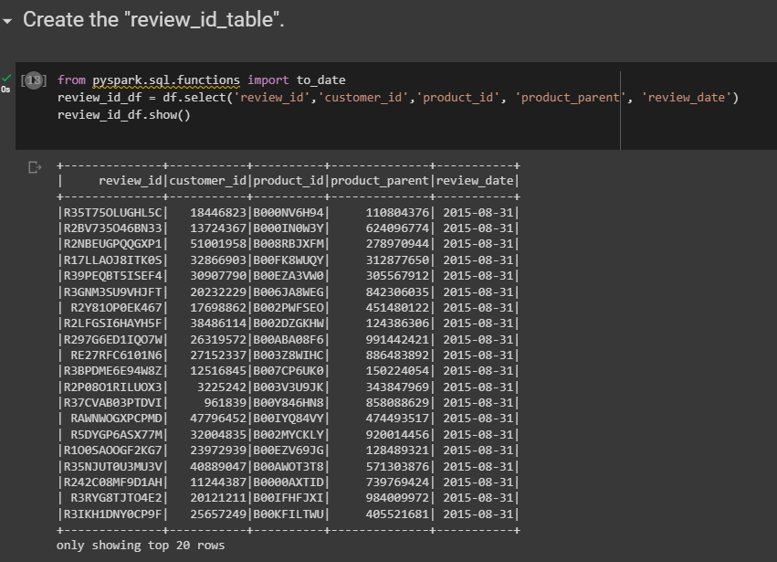
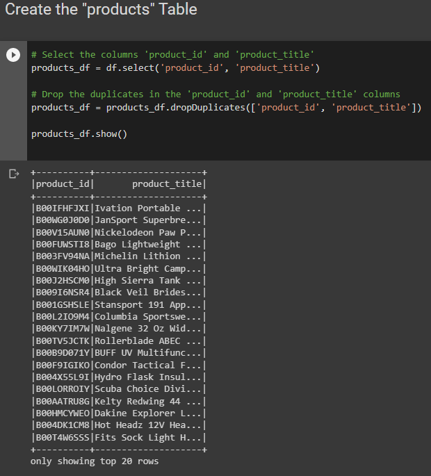
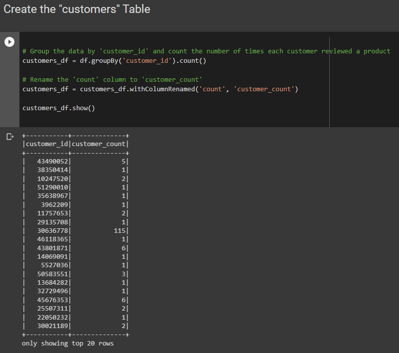
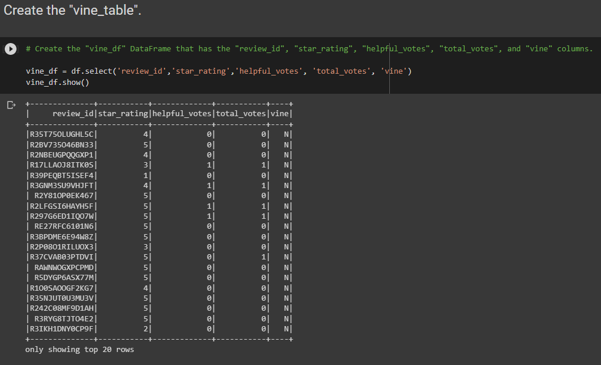
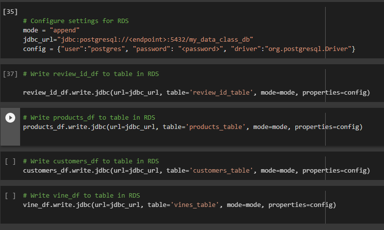

# Amazon Outdoors Reviews ETL

# Overview

This project demonstrates the Extract, Transform, Load (ETL) process using PySpark and PostgreSQL using Google Colab. The data used in this project are Amazon Reviews of US Outdoor products.

## Requirements

* Google Colab
* PySpark
* PostgreSQL

## Setup

1. Make sure you have a Google Colab environment available.
2. Install Spark, and PostgreSQL JDBC driver.
3. Set up the environment variables for Java and Spark.

## Extraction

1. Read the Amazon Reviews of US Outdoor data from an S3 Bucket as a Spark DataFrame.
2. Display the DataFrame and schema.

# Transformation

1. Cast columns to appropriate data types.
2. Create tables: review_id_table, products, customers, and vine_table.
3. Drop duplicates and perform any necessary column renaming.

Review ID Dataframe

Product ID Dataframe

Customers Dataframe

Vine Dataframe

# Loading

1. Configure settings for PostgreSQL RDS.
2. Load data from the transformed DataFrames into their respective tables in PostgreSQL RDS.

## Conclusion

In this project, a successful ETL process was implemented using PySpark to extract data from Amazon Reviews of US Outdoor products, transform the data, and load it into a PostgreSQL database. The demonstration covered working with Spark DataFrames and connecting to a PostgreSQL RDS instance to store the transformed data. This project showcases the power and flexibility of PySpark in handling large datasets and its interoperability with other data storage solutions like PostgreSQL. The ETL pipeline can be further improved and adapted to handle different data sources and transformations as needed.
